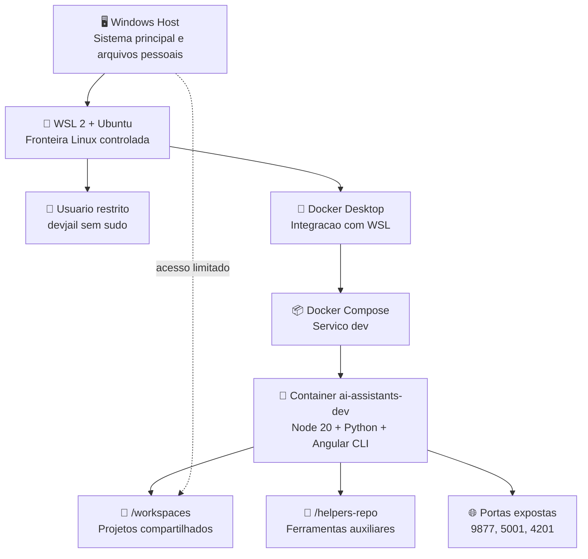
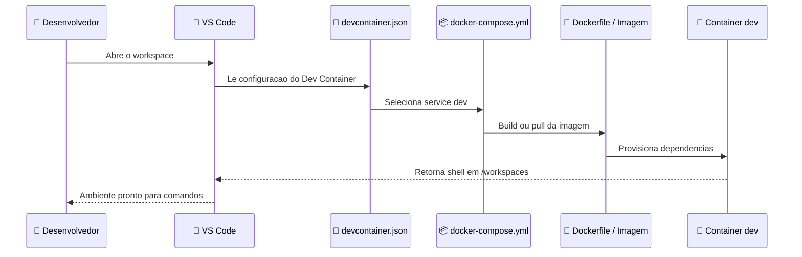
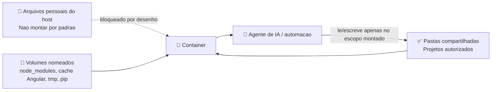
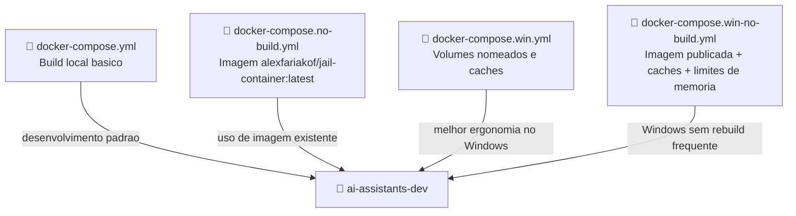

# Jail Container | Ambiente Isolado para Agentes de IA

> Ambiente de desenvolvimento baseado em Docker, WSL e VS Code Dev Containers para executar agentes de IA, automacoes e projetos frontend/backend em um espaco controlado, previsivel e com acesso limitado ao host.

     

## Sumario

- [Visao Geral](#visao-geral)
- [Objetivos](#objetivos)
- [Analise Tecnica](#analise-tecnica)
- [Arquitetura](#arquitetura)
- [Diagramas ](#diagramas)
- [Estrutura do Repositorio](#estrutura-do-repositorio)
- [Componentes Docker](#componentes-docker)
- [Dev Container](#dev-container)
- [Requisitos no Windows](#requisitos-no-windows)
- [Configuracao do WSL](#configuracao-do-wsl)
- [Execucao Local](#execucao-local)
- [Modelo de Isolamento](#modelo-de-isolamento)
- [Hardening e Boas Praticas](#hardening-e-boas-praticas)
- [Troubleshooting](#troubleshooting)
- [Licenca](#licenca)

## Visao Geral

O **Jail Container** organiza um ambiente seguro para interacao com agentes de IA e automacoes de desenvolvimento. A proposta e reduzir o risco de acesso indevido a arquivos pessoais, configuracoes sensiveis e recursos amplos do sistema operacional, mantendo o trabalho concentrado em diretorios explicitamente compartilhados.

A solucao combina:

- **Windows + WSL** como camada base de virtualizacao e separacao do host.
- **Ubuntu no WSL** para execucao de comandos Linux e administracao do workspace.
- **Usuario restrito** sem privilegios administrativos para reduzir superficie de impacto.
- **Docker / Docker Compose** para padronizar imagem, dependencias, volumes e portas.
- **VS Code Dev Containers** para abrir o ambiente ja configurado dentro do container.
- **Imagem Node 20 Bullseye** com Python, Git, Chromium, build tools e Angular CLI.

## Objetivos

- Isolar a execucao de agentes de IA do sistema Windows principal.
- Restringir o acesso do ambiente apenas a pastas compartilhadas.
- Padronizar dependencias de desenvolvimento em container.
- Facilitar execucao de projetos Angular, Node.js, Python e automacoes.
- Reduzir variacao entre maquinas locais e ambientes de desenvolvimento.
- Controlar portas, volumes, caches e logs usados pelo ambiente.

## Analise Tecnica

| Area | Detalhe |
| --- | --- |
| Ambiente base | Windows com WSL 2, Ubuntu e Docker Desktop com integracao WSL habilitada. |
| Container principal | Servico `dev`, nomeado como `ai-assistants-dev`. |
| Imagem base | `node:20-bullseye`. |
| Usuario remoto | `node`, definido no `Dockerfile` e no `devcontainer.json`. |
| Workspace interno | `/workspaces`. |
| Ferramentas instaladas | Python 3, pip, Git, curl, wget, build-essential, Chromium, ca-certificates, nano e Angular CLI global. |
| Volumes | Montagem de `../helpers-repo` e, nas variantes Windows, volumes nomeados para `node_modules`, cache Angular, `/tmp` e cache pip. |
| Portas | `9877:9876`, `5001:5000` e `4201:4200`. |
| Logs | Driver `json-file` com limite de `2m` e retencao de 1 arquivo. |
| Memoria compartilhada | `shm_size: 2g`, util para Chromium, Playwright, testes e automacoes com browser. |

### Pontos Fortes

- Separacao clara entre host, WSL, workspace e container.
- Dev Container pronto para ser aberto pelo VS Code.
- Variantes de Compose para fluxo com build local ou imagem publicada.
- Volumes nomeados nas variantes Windows para melhorar desempenho e reduzir problemas com `node_modules`.
- Limite de logs configurado para evitar crescimento indefinido de arquivos.
- Ambiente adequado para Angular, automacoes Python e execucoes que dependem de Chromium.

### Cuidados Mapeados

| Ponto | Observacao |
| --- | --- |
| Caminhos relativos | Os arquivos Compose assumem repositorios irmaos, como `../AI-Assistants` e `../helpers-repo`. Ajuste os caminhos se a estrutura local for diferente. |
| Usuario Docker | Adicionar usuario ao grupo `docker` permite controlar containers sem `sudo`; trate esse acesso como permissao sensivel. |
| Chroot manual | O fluxo de `chroot` exige copiar binarios e bibliotecas corretamente. Para uso diario, o Dev Container tende a ser mais simples e reprodutivel. |
| Secrets | Nao monte diretorios com chaves SSH, tokens, `.env` de producao ou arquivos pessoais sem necessidade. |
| Licenca | O arquivo `licence` contem textos de licenca com termos diferentes. Revise o modelo juridico antes de publicar o repositorio. |

## Arquitetura

O projeto funciona como uma camada de controle entre o host e o ambiente onde agentes e automacoes executam comandos. O Windows fornece o sistema principal, o WSL cria uma fronteira Linux, e o Docker entrega uma unidade de execucao reproduzivel.

| Camada | Componente | Responsabilidade |
| --- | --- | --- |
| Host | Windows | Sistema principal, arquivos pessoais, Docker Desktop, VS Code e WSL. |
| Virtualizacao | WSL 2 / Ubuntu | Ambiente Linux intermediario para organizar usuarios, paths e integracao Docker. |
| Isolamento | Docker Compose | Define servico, imagem, volumes, portas, logs e limites operacionais. |
| Desenvolvimento | Dev Container | Abre o VS Code dentro do container com usuario e workspace padronizados. |
| Runtime | Container `dev` | Executa agentes de IA, comandos, servidores locais, testes e builds. |
| Workspace | `/workspaces` e volumes | Delimita os arquivos acessiveis pelo container. |

## Diagramas

### Arquitetura de Isolamento



### Fluxo do Dev Container



### Modelo de Acesso a Arquivos



### Variantes de Compose



## Estrutura do Repositorio

```text
.
├── Dockerfile
├── devcontainer.json
├── docker-compose.yml
├── docker-compose.no-build.yml
├── docker-compose.win.yml
├── docker-compose.win-no-build.yml
├── jail-container.code-workspace
├── licence
└── readme.md
```

| Arquivo | Finalidade |
| --- | --- |
| `Dockerfile` | Define a imagem de desenvolvimento com Node 20, Python, Git, Chromium, build tools e Angular CLI. |
| `devcontainer.json` | Configura o VS Code Dev Containers para usar o servico `dev`, workspace `/workspaces` e usuario `node`. |
| `docker-compose.yml` | Compose principal com build local, volumes, portas, shell e limites de log. |
| `docker-compose.no-build.yml` | Variante que referencia a imagem `alexfariakof/jail-container:latest`. |
| `docker-compose.win.yml` | Variante para Windows com volumes nomeados para caches e dependencias. |
| `docker-compose.win-no-build.yml` | Variante Windows com imagem publicada, caches e limites de memoria em `deploy.resources`. |
| `jail-container.code-workspace` | Workspace do VS Code com pastas, formatacao e extensoes recomendadas. |
| `licence` | Texto de licenca do projeto. |

## Componentes Docker

### Imagem

O `Dockerfile` parte de `node:20-bullseye` e instala ferramentas comuns para desenvolvimento e automacao:

- Python 3 e pip.
- Git, curl e wget.
- `build-essential` para compilacoes nativas.
- Chromium para testes, automacoes e navegacao headless.
- Angular CLI instalado globalmente via npm.
- Prompt e alias basicos aplicados em `/etc/bash.bashrc`.

### Servico `dev`

O servico principal e configurado com:

| Configuracao | Valor |
| --- | --- |
| Nome do container | `ai-assistants-dev` |
| Comando | `/bin/bash -l` |
| SHM | `2g` |
| Porta app/browser | `4201:4200` |
| Porta API | `5001:5000` |
| Porta auxiliar | `9877:9876` |
| Volume auxiliar | `../helpers-repo:/helpers-repo` |
| Log maximo | `2m`, 1 arquivo |

## Dev Container

O arquivo `devcontainer.json` integra o ambiente ao VS Code:

```json
{
  "name": "Ai Assistants",
  "dockerComposeFile": "docker-compose.yml",
  "service": "dev",
  "workspaceFolder": "/workspaces",
  "remoteUser": "node",
  "overrideCommand": false
}
```

Na pratica, o VS Code:

1. Le o `devcontainer.json`.
2. Sobe o servico `dev` via Docker Compose.
3. Conecta a janela remota dentro do container.
4. Usa `/workspaces` como pasta base.
5. Executa comandos como usuario `node`.

## Requisitos no Windows

### 1. Ativar recursos do Windows pela interface

1. Abra o menu iniciar.
2. Pesquise por `Ativar ou desativar recursos do Windows`.
3. Habilite:
   - Windows Subsystem for Linux.
   - Plataforma de Maquina Virtual.
   - Plataforma do Hipervisor do Windows.
4. Clique em `OK`.
5. Reinicie o computador.

### 2. Ativar recursos via PowerShell

Abra o PowerShell como Administrador:

```powershell
dism.exe /online /enable-feature /featurename:Microsoft-Windows-Subsystem-Linux /all /norestart
dism.exe /online /enable-feature /featurename:VirtualMachinePlatform /all /norestart
dism.exe /online /enable-feature /featurename:HypervisorPlatform /all /norestart
```

Reinicie o computador apos a execucao.

### 3. Instalar WSL

```powershell
wsl --install
```

### 4. Instalar Ubuntu

Instale uma distribuicao pelo Microsoft Store:

- Ubuntu 22.04 LTS.
- Ubuntu 24.04 LTS.

Depois acesse:

```powershell
wsl
```

Ou diretamente:

```powershell
wsl -d Ubuntu
```

### 5. Instalar Docker Desktop

Durante a instalacao:

- Habilite backend WSL 2.
- Habilite integracao com a distribuicao Ubuntu.
- Confirme que o comando `docker ps` funciona dentro do WSL.

### 6. Instalar VS Code

Extensoes recomendadas:

- Dev Containers.
- Docker.
- Remote - WSL.

## Configuracao do WSL

### Atualizar o Ubuntu

```bash
sudo apt update && sudo apt upgrade -y
```

### Criar usuario restrito

```bash
sudo adduser devjail
```

Nao adicione esse usuario ao grupo `sudo` se a intencao for manter a fronteira operacional mais restrita.

### Permitir uso do Docker

```bash
sudo usermod -aG docker devjail
```

Depois encerre e reabra a sessao do WSL para o grupo ser aplicado.

## Execucao Local

### Subir com build local

```bash
docker compose up --build
```

### Subir em segundo plano

```bash
docker compose up -d --build
```

### Acessar o shell do container

```bash
docker exec -it ai-assistants-dev bash -l
```

### Parar o ambiente

```bash
docker compose down
```

### Usar variante Windows

```bash
docker compose -f docker-compose.win.yml up -d --build
```

### Usar imagem publicada

```bash
docker compose -f docker-compose.no-build.yml up -d
```

### Usar imagem publicada com caches Windows

```bash
docker compose -f docker-compose.win-no-build.yml up -d
```

## Modelo de Isolamento

### Criar workspace controlado

```bash
mkdir -p /home/devjail/workspace
```

### Compartilhar apenas uma pasta autorizada

Exemplo:

```bash
sudo ln -s /mnt/c/Projetos /home/devjail/workspace/projetos
```

Assim, o ambiente trabalha sobre um escopo explicito, em vez de acessar todo o disco do Windows.

### Ajustar permissoes

```bash
sudo chown -R devjail:devjail /home/devjail/workspace
```

### Criar jail via chroot

```bash
sudo mkdir -p /jail/devjail/{bin,lib,lib64,home}
sudo cp /bin/{ls,cat,pwd,echo,bash} /jail/devjail/bin/
```

Entrada basica:

```bash
sudo chroot /jail/devjail /bin/bash
```

Entrada com UID/GID especifico:

```bash
sudo chroot --userspec=1001:1001 /jail/devjail /bin/bash
```

> Observacao: um `chroot` funcional precisa das bibliotecas dinamicas dos binarios copiados. Em cenarios de desenvolvimento, Docker e Dev Containers costumam ser mais previsiveis e faceis de auditar.

## Hardening e Boas Praticas

- Monte somente diretorios necessarios ao trabalho do agente.
- Evite montar `$HOME`, `.ssh`, pastas de cloud drive, tokens e arquivos `.env` sensiveis.
- Prefira volumes nomeados para caches pesados, como `node_modules` e `.angular`.
- Mantenha logs com limite de tamanho para evitar consumo silencioso de disco.
- Execute servidores internos usando as portas ja mapeadas no Compose.
- Revise permissoes do usuario WSL antes de conceder acesso ao Docker.
- Use imagens versionadas quando precisar de reprodutibilidade estrita.
- Faca rebuild da imagem ao alterar dependencias do `Dockerfile`.

## Troubleshooting

| Sintoma | Verificacao |
| --- | --- |
| Docker nao aparece no WSL | Confirme a integracao WSL no Docker Desktop e execute `docker ps` dentro do Ubuntu. |
| VS Code nao abre no container | Verifique se a extensao Dev Containers esta instalada e se o Compose sobe sem erro. |
| Porta 4201 ocupada | Altere o mapeamento `4201:4200` no Compose ou encerre o processo que usa a porta. |
| `node_modules` lento no Windows | Use `docker-compose.win.yml`, que preserva `node_modules` em volume nomeado. |
| Chromium falha em testes | Confirme `shm_size: "2g"` e dependencias instaladas na imagem. |
| Caminho de build nao encontrado | Ajuste `build.context` e `dockerfile` para refletir sua estrutura local de pastas. |

## Licenca

Consulte o arquivo [`licence`](licence). Antes de publicar ou redistribuir, revise os termos aplicaveis e garanta que eles estejam consistentes com a intencao juridica do projeto.
